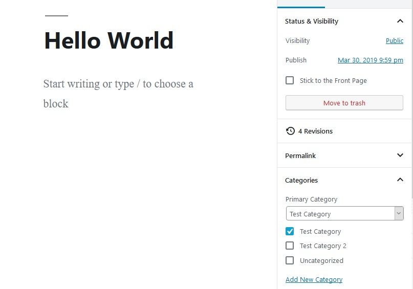

# Primary Taxonomy Term for WordPress

This WordPress plugin adds a primary category dropdown to the Gutenberg post editor document block. The primary category can be useful for SEO purposes and assist publishers and editors in organizing content effectively.

> Notice: This is an exploratory project, and is not suggested for production use. Feel free to fork and/or PR if you feel so inclined.

### Todo

[ ] Selecting additional category should not automatically reset the primary
[ ] Hook into post autosave/save instead of saving on `onchange` event of select
[ ] Add template functions & implement hooks for displaying primary category on front-end
[x] Add option to implement for taxonomies other than just categories
[ ] Fix display issue when toggling between Document and Block tabs
[ ] Additional testing